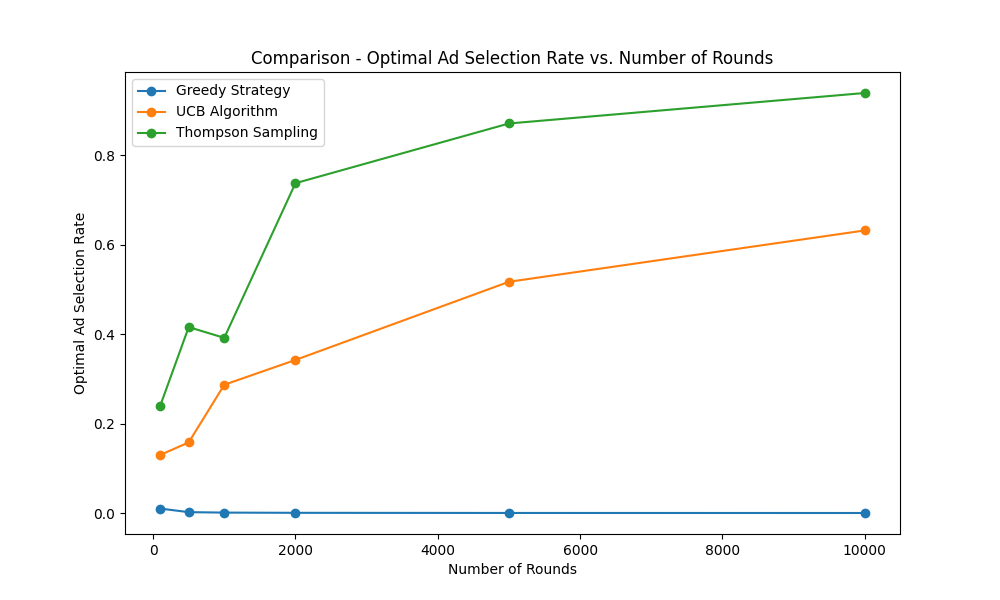

# **Advertisement Optimization using Reinforcement Learning**

## **Table of Contents**

1. [Introduction](#introduction)
2. [Methodology](#methodology)
   - [Upper Confidence Bound (UCB)](#upper-confidence-bound-ucb)
   - [Thompson Sampling](#thompson-sampling)
   - [Greedy Sampling](#greedy-sampling)
3. [Results](#results)
   - [UCB Results](#ucb-results)
   - [Thompson Sampling Results](#thompson-sampling-results)
   - [Greedy Sampling Results](#greedy-sampling-results)
   - [Comparative Analysis](#comparative-analysis)
4. [Discussion](#discussion)
5. [Conclusion](#conclusion)
6. [References](#references)

---

## **Introduction**

In the highly competitive automotive industry, effective advertising is crucial for attracting potential customers. We are provided with a dataset from a car company containing user interactions with **10 different ads**. Each ad represents a marketing strategy aiming to maximize user engagement.

The dataset consists of **10,000 entries**, where each row corresponds to a user, and each column represents an ad. The data is encoded with binary values (0 or 1), indicating whether a user clicked on a specific ad (1 for click, 0 for no click).

In a real-world scenario, we would require streaming data to analyze user interactions in real-time or collect data for batch analysis. Deploying ads is costly, and it's essential to determine which ad yields the best return on investment (ROI) in the minimum number of rounds. The goal is to quickly identify the most effective ad to maximize conversions and eliminate less efficient ads from circulation.

This project aims to implement and compare three algorithms for ad selection optimization based on click-through rates (CTR):

- **Upper Confidence Bound (UCB)**
- **Thompson Sampling**
- **Greedy Sampling**

Each algorithm balances the exploration-exploitation trade-off differently. We will analyze their performance in terms of total rewards, average rewards per round, and the rate at which they select the optimal ad.

---

## **Methodology**

### **Upper Confidence Bound (UCB)**

The UCB algorithm selects ads based on the upper confidence bound of the estimated reward for each ad. At each round, it selects the ad with the highest upper bound, calculated using the average reward and an exploration term that decreases as more data is collected.

**Formula**:

For each ad $i$ at round $n$:

$$
\text{Upper Bound}_i = \overline{x}_i + \sqrt{\frac{3}{2} \cdot \frac{\ln(n + 1)}{N_i}}
$$

- $\overline{x}_i$: Average reward of ad $i$ up to round $n$.
- $N_i$: Number of times ad $i$ has been selected up to round $n$.
- $\ln(n + 1)$: Natural logarithm of the round number (plus one to avoid $\ln(0)$).

**Advantages**:

- Efficiently balances exploration and exploitation.
- Provides a theoretical guarantee on performance.
- Quickly identifies the optimal ad without exhaustive exploration.

**Disadvantages**:

- Requires maintaining counts and sums for each ad.
- Exploration term may be too optimistic in some cases.

---

### **Thompson Sampling**

Thompson Sampling is a probabilistic algorithm that selects ads based on sampling from a posterior distribution of the ad's reward probabilities. At each round, it samples from the Beta distribution for each ad and selects the ad with the highest sampled value.

**Formula**:

For each ad $i$:

1. Sample $\theta_i$ from $\text{Beta}(\alpha_i + 1, \beta_i + 1)$, where:
   - $\alpha_i$: Number of times ad $i$ received a reward of 1.
   - $\beta_i$: Number of times ad $i$ received a reward of 0.
2. Select the ad $i$ with the highest $\theta_i$.

**Advantages**:

- Naturally balances exploration and exploitation through Bayesian updating.
- Performs well in practice, often outperforming UCB.
- Simple to implement with conjugate priors.

**Disadvantages**:

- Randomness in sampling can lead to variability in performance.
- Requires updating and sampling from probability distributions.

---

### **Greedy Sampling**

The Greedy algorithm always selects the ad with the highest estimated average reward based on past data. It exploits the current best-known ad without exploring other options.

**Formula**:

For each ad $i$:

- $\overline{x}_i = \frac{\text{Total Rewards for Ad } i}{\text{Number of Times Ad } i \text{ was Selected}}$

At each round, select the ad $i$ with the highest $\overline{x}_i$.

**Advantages**:

- Simple and easy to implement.
- Focuses on exploiting the best-known option.

**Disadvantages**:

- Lacks exploration, which may lead to suboptimal performance.
- Can get stuck selecting a suboptimal ad if early estimates are misleading.

---

## **Results**

### **UCB Results**

| Rounds | Total Reward | Average Reward per Round | Optimal Ad Selection Rate |
|--------|--------------|--------------------------|---------------------------|
| 100    | 13           | 0.1300                   | 13.00%                    |
| 500    | 60           | 0.1200                   | 15.80%                    |
| 1,000  | 155          | 0.1550                   | 28.70%                    |
| 2,000  | 331          | 0.1655                   | 34.25%                    |
| 5,000  | 996          | 0.1992                   | 51.74%                    |
| 10,000 | 2,178        | 0.2178                   | 63.23%                    |

#### **Total Reward vs. Number of Rounds**

**Figure 1:** UCB - Total Reward achieved across different numbers of rounds.

In Figure 1, we observe that the total reward increases with the number of rounds. This trend is expected since more rounds provide more opportunities to accumulate rewards. The increasing slope suggests that the algorithm is improving its ad selection over time, leading to higher cumulative rewards.

#### **Average Reward per Round vs. Number of Rounds**

**Figure 2:** UCB - Average Reward per Round across different numbers of rounds.

Figure 2 illustrates that the average reward per round improves as the number of rounds increases. This indicates that the algorithm becomes more efficient at selecting higher-performing ads over time, enhancing its exploitation of the best options.

#### **Optimal Ad Selection Rate vs. Number of Rounds**

**Figure 3:** UCB - Rate at which the optimal ad was selected across different numbers of rounds.

In Figure 3, we observe that the optimal ad selection rate increases with the number of rounds. Starting from **13.00%** at 100 rounds, it rises to **63.23%** at 10,000 rounds. This demonstrates the algorithm's learning process, progressively identifying and favoring the optimal ad as it gathers more data.

Notably, even after just **1,000 rounds**, the algorithm identifies **Ad 4** as the best-performing ad with a significant increase in the optimal ad selection rate to **28.70%**. This early convergence highlights the efficiency of the UCB algorithm in reducing the number of rounds needed to reach a confident decision.

#### **Histograms of Ads Selections Across Runs**

**Figure 4:** UCB - Histograms showing the number of times each ad was selected during different runs.

Figure 4 presents a series of histograms depicting the distribution of ad selections for each tested number of rounds:

- **N=100**: The selections are relatively uniform across ads, indicating initial exploration.
- **N=500 & N=1,000**: Certain ads start to be selected more frequently as the algorithm gathers more data. **Ad 4** begins to emerge as a preferred choice.
- **N=2,000 & N=5,000**: The algorithm increasingly focuses on specific ads, particularly **Ad 4**, confirming its superior performance.
- **N=10,000**: **Ad 4** is selected significantly more often than others, showing strong convergence to the optimal ad.

These histograms visually demonstrate how the UCB algorithm shifts from exploration to exploitation over time, ultimately favoring the optimal ad as more rounds are completed. The ability to identify the best ad in fewer rounds reduces costs and improves the efficiency of ad deployment.

---

### **Thompson Sampling Results**

| Rounds | Total Reward | Average Reward per Round | Optimal Ad Selection Rate |
|--------|--------------|--------------------------|---------------------------|
| 100    | 18           | 0.1800                   | 24.00%                    |
| 500    | 91           | 0.1820                   | 41.60%                    |
| 1,000  | 187          | 0.1870                   | 39.20%                    |
| 2,000  | 497          | 0.2485                   | 73.80%                    |
| 5,000  | 1,301        | 0.2602                   | 87.16%                    |
| 10,000 | 2,613        | 0.2613                   | 93.98%                    |

#### **Total Reward vs. Number of Rounds**

**Figure 5:** Thompson Sampling - Total Reward achieved across different numbers of rounds.

In Figure 5, we observe a steady increase in the total reward as the number of rounds increases. The total reward grows significantly faster than in the UCB algorithm, especially at higher numbers of rounds. This indicates that Thompson Sampling is more effective at accumulating rewards over time due to its efficient balance between exploration and exploitation.

#### **Average Reward per Round vs. Number of Rounds**

**Figure 6:** Thompson Sampling - Average Reward per Round across different numbers of rounds.

Figure 6 shows that the average reward per round improves with the number of rounds. Notably, Thompson Sampling achieves a higher average reward per round compared to UCB at similar rounds, indicating its superior ability to select better-performing ads earlier and more consistently.

#### **Optimal Ad Selection Rate vs. Number of Rounds**

**Figure 7:** Thompson Sampling - Rate at which the optimal ad was selected across different numbers of rounds.

In Figure 7, the optimal ad selection rate increases rapidly with the number of rounds. Starting at **24.00%** for 100 rounds, it jumps to **73.80%** at 2,000 rounds and reaches **93.98%** at 10,000 rounds. This rapid convergence indicates that Thompson Sampling effectively identifies and exploits the optimal ad much faster than UCB.

#### **Histograms of Ads Selections Across Runs**

**Figure 8:** Thompson Sampling - Histograms showing the number of times each ad was selected during different runs.

Figure 8 illustrates the distribution of ad selections across different numbers of rounds:

- **N=100 & N=500**: Even in early rounds, Thompson Sampling starts favoring certain ads, especially the optimal ad.
- **N=1,000**: The selection frequency of the optimal ad increases significantly.
- **N=2,000 & N=5,000**: The optimal ad dominates the selection, with other ads being chosen less frequently.
- **N=10,000**: The algorithm almost exclusively selects the optimal ad, demonstrating strong convergence.

These histograms showcase Thompson Sampling's ability to efficiently learn and prioritize the best-performing ad while still allowing for occasional exploration.

---

### **Greedy Sampling Results**

| Rounds | Total Reward | Average Reward per Round | Optimal Ad Selection Rate |
|--------|--------------|--------------------------|---------------------------|
| 100    | 7            | 0.0700                   | 1.00%                     |
| 500    | 79           | 0.1580                   | 0.20%                     |
| 1,000  | 157          | 0.1570                   | 0.10%                     |
| 2,000  | 339          | 0.1695                   | 0.05%                     |
| 5,000  | 845          | 0.1690                   | 0.02%                     |
| 10,000 | 1,701        | 0.1701                   | 0.01%                     |

#### **Total Reward vs. Number of Rounds**

**Figure 9:** Greedy Strategy - Total Reward achieved across different numbers of rounds.

In Figure 9, the total reward increases linearly with the number of rounds, but at a significantly lower rate compared to UCB and Thompson Sampling. This linear growth indicates that the Greedy Strategy fails to improve its performance over time due to its lack of exploration, resulting in consistently lower total rewards.

#### **Average Reward per Round vs. Number of Rounds**

**Figure 10:** Greedy Strategy - Average Reward per Round across different numbers of rounds.

Figure 10 shows that the average reward per round for the Greedy Strategy remains relatively constant, hovering around 0.17. This stagnation highlights the algorithm's inability to learn and improve over time, as it gets stuck exploiting suboptimal ads based on initial estimates.

#### **Optimal Ad Selection Rate vs. Number of Rounds**

**Figure 11:** Greedy Strategy - Rate at which the optimal ad was selected across different numbers of rounds.

In Figure 11, the optimal ad selection rate for the Greedy Strategy is extremely low, decreasing as the number of rounds increases. It starts at **1.00%** for 100 rounds and drops to **0.01%** at 10,000 rounds. This indicates that the Greedy Strategy rarely selects the optimal ad, showcasing its failure to explore and identify better-performing ads.

#### **Histograms of Ads Selections Across Runs**

**Figure 12:** Greedy Strategy - Histograms showing the number of times each ad was selected during different runs.

Figure 12 displays the selection distribution for the Greedy Strategy:

- Across all numbers of rounds, the algorithm consistently selects the same ad based on initial observations.
- The lack of diversity in ad selection indicates minimal exploration.
- The optimal ad is rarely selected, as evident from its low frequency in the histograms.

These patterns confirm that the Greedy Strategy does not adapt over time and remains suboptimal due to its exploitation-focused approach without sufficient exploration.

---

### **Comparative Analysis**

#### **Total Rewards Comparison**

**Figure 13:** Comparison of Total Rewards across different numbers of rounds for all algorithms.

In Figure 13, we compare the total rewards of all three algorithms:

- **Thompson Sampling** consistently achieves the highest total rewards, demonstrating superior performance.
- **UCB Algorithm** performs better than the Greedy Strategy but lags behind Thompson Sampling.
- **Greedy Strategy** has the lowest total rewards, reflecting its inability to improve over time.

This comparison highlights the effectiveness of algorithms that balance exploration and exploitation, with Thompson Sampling leading in overall performance.

#### **Average Reward per Round Comparison**

**Figure 14:** Comparison of Average Reward per Round across different numbers of rounds for all algorithms.

Figure 14 shows:

- **Thompson Sampling** achieves the highest average reward per round, especially as the number of rounds increases.
- **UCB Algorithm** shows steady improvement over time but does not reach the levels of Thompson Sampling.
- **Greedy Strategy** maintains a relatively low and constant average reward per round.

This indicates that Thompson Sampling not only accumulates more rewards but does so more efficiently on a per-round basis.

#### **Optimal Ad Selection Rate Comparison**

**Figure 15:** Comparison of Optimal Ad Selection Rates across different numbers of rounds for all algorithms.

In Figure 15:

- **Thompson Sampling** rapidly increases its optimal ad selection rate, surpassing 90% at 10,000 rounds.
- **UCB Algorithm** shows a steady increase but at a slower rate, reaching around 63% at 10,000 rounds.
- **Greedy Strategy** has an extremely low optimal ad selection rate, which decreases over time.

This comparison emphasizes Thompson Sampling's efficiency in identifying and focusing on the optimal ad.

#### **Histograms of Ads Selections for All Algorithms**

**Figure 16:** Histograms showing the number of times each ad was selected by each algorithm during 10,000 rounds.

Figure 16 compares the ad selection distribution:

- **Thompson Sampling** predominantly selects the optimal ad, with minimal selection of other ads.
- **UCB Algorithm** also favors the optimal ad but with more selections of suboptimal ads compared to Thompson Sampling.
- **Greedy Strategy** heavily selects a non-optimal ad, indicating its failure to identify the best-performing ad.

This comparison highlights how the algorithms differ in their exploration-exploitation strategies and their effectiveness in converging to the optimal ad.

---

## **Discussion**

The comparative analysis reveals the strengths and weaknesses of each algorithm:

- **Greedy Strategy**:
  - **Disadvantage**: Lack of exploration leads to poor performance, as it consistently selects the ad with the highest observed average reward, which may not be the optimal ad due to limited initial data.
  - **Advantage**: Simplicity in implementation.
  - **Observation**: The Greedy Strategy shows a low total reward and average reward per round compared to UCB and Thompson Sampling. The optimal ad selection rate remains negligible, indicating it rarely selects the optimal ad.

- **Upper Confidence Bound (UCB)**:
  - **Advantage**: Balances exploration and exploitation using a confidence bound, significantly outperforming the Greedy Strategy.
  - **Disadvantage**: Requires more rounds to converge compared to Thompson Sampling.
  - **Observation**: UCB shows increasing total rewards and optimal ad selection rates with more rounds, indicating effective learning over time.

- **Thompson Sampling**:
  - **Advantage**: Demonstrates superior performance by using probabilistic sampling to balance exploration and exploitation.
  - **Disadvantage**: Randomness in the algorithm can introduce variability in results.
  - **Observation**: Thompson Sampling outperforms both UCB and Greedy Strategy in terms of total rewards, average rewards per round, and optimal ad selection rates, especially evident in longer runs.

**Key Insights**:

- **Thompson Sampling** consistently achieves higher total rewards and optimal ad selection rates, making it the most effective algorithm in this context.
- **UCB Algorithm** performs well but is slightly outperformed by Thompson Sampling.
- **Greedy Strategy** is insufficient for problems requiring a balance between exploration and exploitation, as it fails to adequately explore and thus often misses the optimal ad.

---

## **Conclusion**

In optimizing ad selection for maximizing click-through rates, the choice of algorithm significantly impacts performance:

- **Thompson Sampling** is recommended due to its high efficiency in identifying and exploiting the optimal ad.
- **UCB Algorithm** serves as a robust alternative, especially when probabilistic sampling is not preferred.
- **Greedy Strategy** is not suitable for this task due to its lack of exploration, leading to suboptimal results.

Implementing advanced reinforcement learning algorithms like Thompson Sampling can lead to substantial improvements in advertising strategies, reducing costs and increasing user engagement.

---

## **References**

1. Machine Learning A-Z: AI, Python & R [2024]  
Created by Hadelin de Ponteves, Kirill Eremenko, SuperDataScience Team, and the Ligency Team  
[https://www.udemy.com/course/machinelearning/](https://www.udemy.com/course/machinelearning/)
2. Auer, P., Cesa-Bianchi, N., & Fischer, P. (2002). **Finite-time Analysis of the Multiarmed Bandit Problem**. Machine Learning, 47(2-3), 235-256.
3. Sutton, R. S., & Barto, A. G. (2018). **Reinforcement Learning: An Introduction**. MIT Press.
4. Chapelle, O., & Li, L. (2011). **An Empirical Evaluation of Thompson Sampling**. Advances in Neural Information Processing Systems, 24.
---
